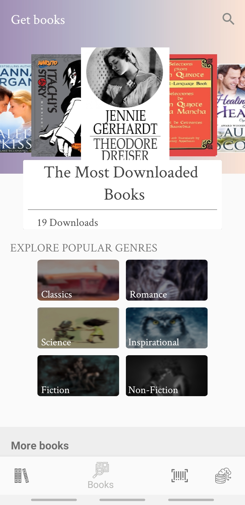
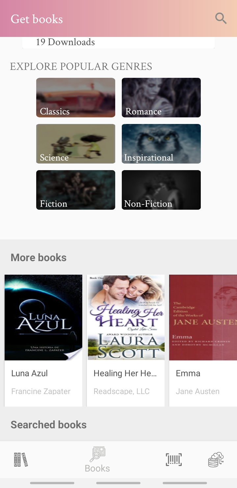
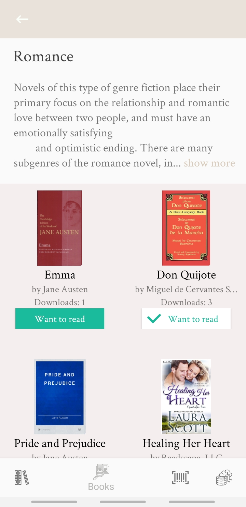
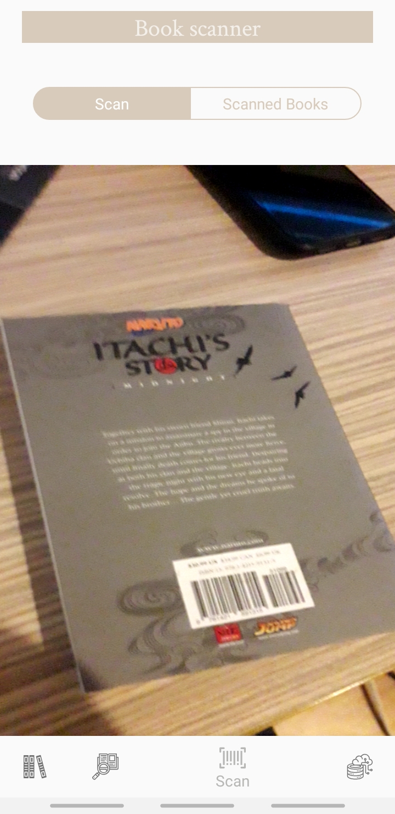
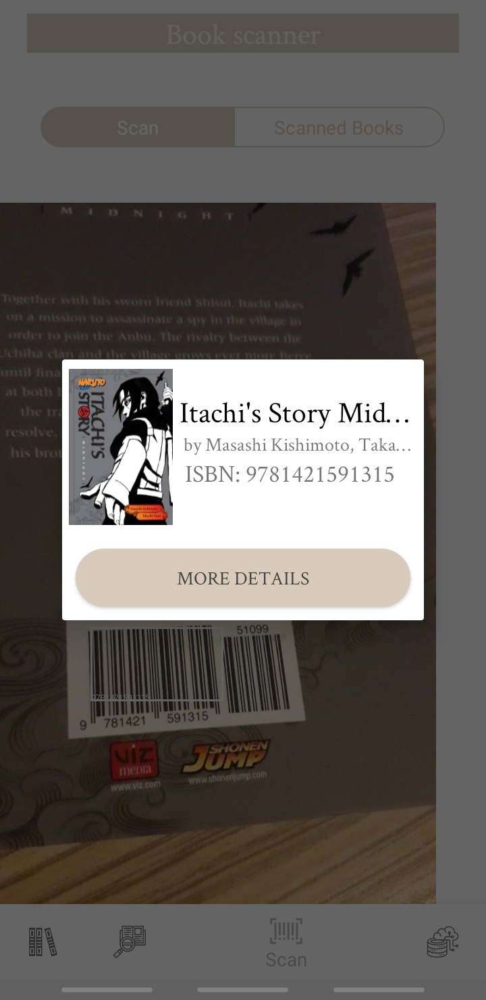
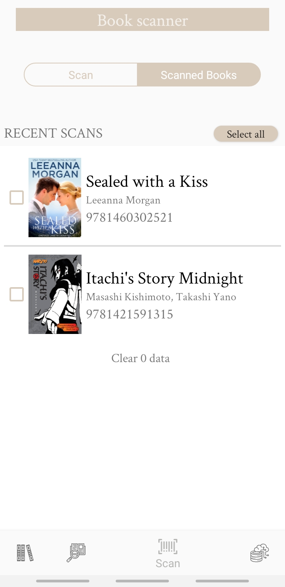
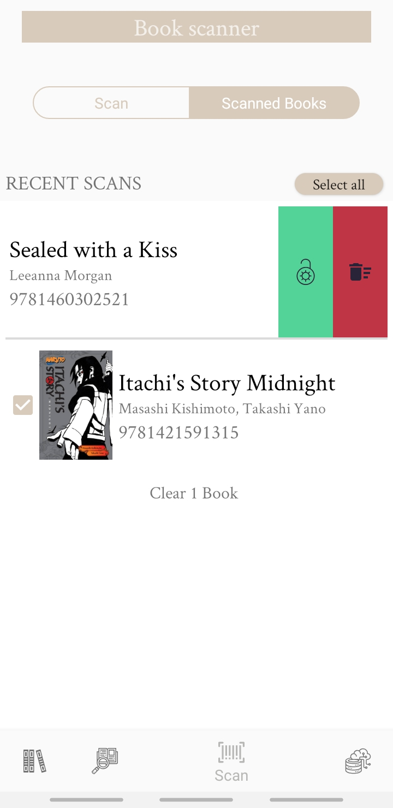

      --- Books Fever ---

---------- Features for own library management ----------

  • Search for books in cloud
  
  • Create shelves, add book to it, delete books, sorting by information
  
  • Scanner for isbn to find easly books in cloud
  
  • Backup and restore system
  
  • Want to read - counter and list
  
  • Details about the most downloaded books
  
  
  
---------- Functionalities on the book content ----------

  • Full content
  
  • Day-Night mode
  
  • Luminosity control
  
  • Text-To-Speech
  
  • Bookmark
  
  • Spacing
  
  • Highlight
  
  • Note
  
  • Search in book's content
  
  • List of chapters to navigate easly
  
  • List of highlights and bookmarks for a good administration of the content
  
  • Increase and decrease font
  
  • Custom font
  
  • Changing background and foreground
  
  • Sharing quotes
  
  • Dictionary for every word --> Oxford Dictionary API
  
  • Seek bar for easy-to-use navigation in chapter 
  
  
 ---------- Estimator pattern ----------
  
  In order to estimate how long a user can finish a chapter, I had to take into account several variables.
  For calculating the difficulty coefficient I used Gunning Fog Score, consists in applying a text or a paragraph with a lenght of about 100 - 200 words, from this paragraph we extract the exact number of words, number sentences, but also the number of complex words ( provided, they had to have 3 syllables or more, soo the words that have common prefixes and suffixes (eg "ing","ous" etc.) are eliminated ).
  To optimize the estimate in algorithm I also calculated the average time spent on each page.
  
  ---------- Tehnologies used ----------
  
  Own server to make communication with database: NodeJS, MongoDB
  
  API used: Google Books API, Oxford Dictionary API, Google Vision API
  
  Android Studio: RxJava 2, Retrofit 2, Room Persistence Library, SkyEpub Reader
  
  
  <h3> SignIn/SignUp Activity </h3>
 
 
 
   
   <h3> Home Activity </h3>
   
 There is the Container Activity that stores 4 fragments, we'll talk later about them 

   <h5> Books Fragment </h5>

  
 
 
 

 
   
   <h5> Scanner Books Fragment </h5>

  
 
 
 
 

   
   
 
  
  
  
  
  
  
  
